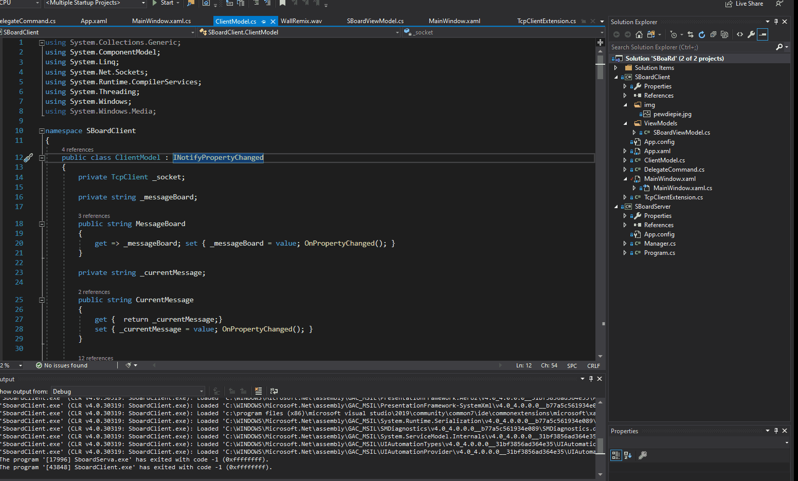
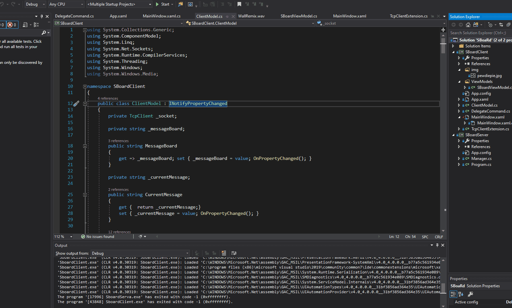
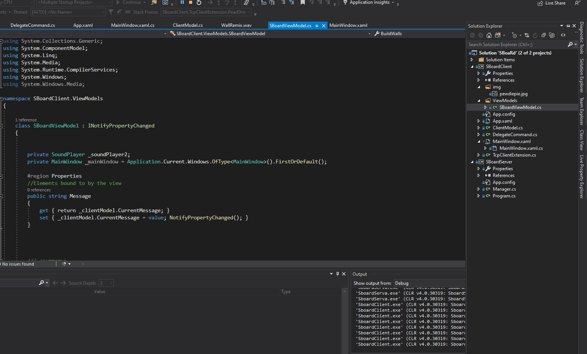

# memeBoard
The goal of this product is to create a multi-connect soundboard that shares meme sounds between two computers through a network. 

<h2>Technologies</h2>
.NET WPF, C#
<h2>Live Demo </h2>
goto: https://www.youtube.com/watch?v=4_4Qy8zlrQk

<h2>Deployment </h2>
<strong>Tools Needed: Visual Studio 2017 and UP, .NET WPF</strong>
 
 
 <strong>Change which project to run by selecting the properties of the project.</strong>
  
  

<strong>Running the application: Hit the play button at the top.</strong>
  
  

<strong>To add another client board, right click the SBoard client, hover on debug, and click run.</strong>
  
  

<strong>Enjoy :)</strong> 
